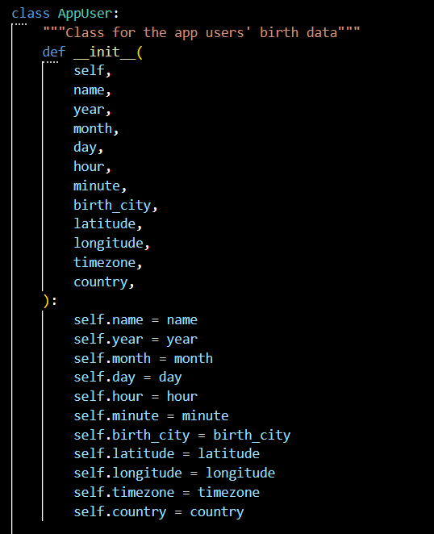
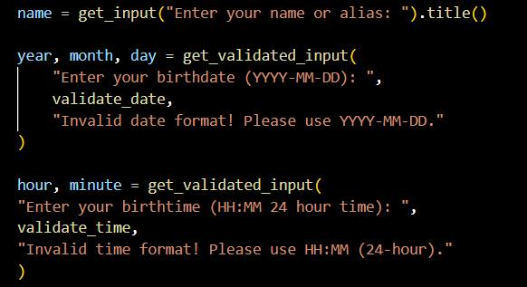
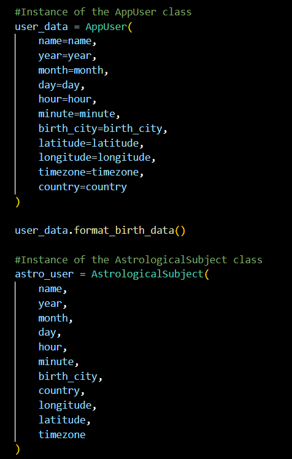
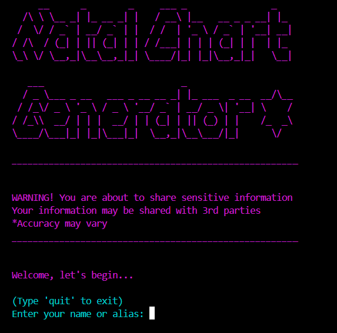
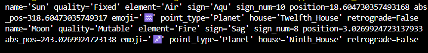
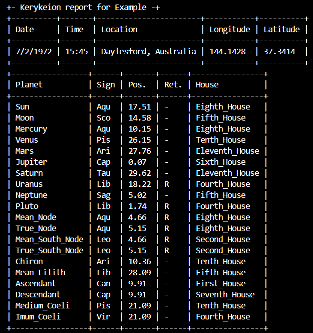
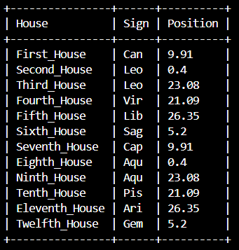

# 🔮✨ Natal Chart Generator ✨🔮

> The Natal Chart Generator is a simple command-line  application used to identify the position of the planets at the time of the users birth. This application generates an SVG chart for the user to keep.

## Background & Planning

In preparation for building this app, an analysis was conducted to compare astrological/natal Python libraries. Most of these libraries are based on the Swiss Ephemeris library (pyswisseph) which calculates astrological data and the Olsen Timezone Database (pytz) which enables timezone calculations and corrections.

From the list of relevant libraries - two were selected and compared (Kerykeion | Natal) with Kerykeion being a better fit for this application due to it's ability to input latitude, longitude and timezone, rather than needing to convert timezones manually.

## Acknowledgments

Some idea generation, library/licence comparisons, and guidance on document structure were provided by ChatGPT (GPT-4o, OpenAI, 2025).

## Installation & Requirements

*Kerykeion* requires Python 3.9 or higher. *Figlet* requires Python 3.9 or higher. *Colorama* will work on a range of Python versions which includes 3.9/3.10. *Pytz* requires Python 2.4 or higher. *OS*, *Datetime*, and *Sys* are standard libraries for Python.

See [Requirements File](./requirements.txt).

### - Installation of Application -

Clone (or fork, then clone) the below repository or open the folder, if a local copy has been provided:

```py
git clone https://github.com/BeeGeeEss/natal_chart_app
cd natal_chart_app
```

Create and activate a virtual environment:

```py
python -m venv venv
source venv/bin/activate
```

Run the script:

```py
python main.py
```

### - Installation of Libraries -

Libraries can be installed with pip:

```py
pip install pyfiglet
```

```py
pip install colorama
```

```py
pip install kerykeion
```

```py
pip install pytz
```

If you face any issues with components of the Kerykeion library (functions not running as predicted), you can manually install pyswisseph:

```py
pip install pyswisseph
```

### - Standard Libraries -

Os, Sys and Datetime are standard python libraries and can be imported without pip installation (using 'import').

## Basic Usage

### - Sys -

The usage of the sys library in this application is purely to exit the application when a 'QuitApp' exception has been raised:

```py
import sys
sys.exit()
```

### - Os -

The usage of the Os library in this application is to ensure that a file path exists, for the SVG files to be stored to a folder, within the project (otherwise they will be stored in the root folder).
If you decide to use the 'Generate_SVGs' folder, you need to hardcode the path on your local computer:

```py
import os
output_path = "/root/parentfolder//Natal-Chart-App Generated_SVGs"
        os.makedirs(output_path, exist_ok=True)

```

### - Datetime -

The usage of the datetime library in this application is to validate the format of date and time values input by the user:

```py
from datetime import datetime
def validate_date(date_str):
    dt = datetime.strptime(date_str, "%Y-%m-%d")
    return dt.year, dt.month, dt.day
```

### - Figlet -

The usage of the pyfiglet library in this application is to add a font to the text in the application header:

```py
from pyfiglet import Figlet
f = Figlet(font='slant')
print(f.renderText('text to render'))
```

### - Colorama -

The usage of the Colorama library in this application is to change the colour of the CLI text. Before use, you must initialise Colorama:

```py
from colorama import init
init(autoreset=True)

print(Fore.WHITE + "Goodbye!")
print(Fore.RED + error_message)
```

### - Pytz -

The usage of the Pytz library in this application is to support the Kerykeion classes, with accurate timezone information:

```py
import pytz
def validate_timezone(tz_str):
    if tz_str not in pytz.all_timezones:
        raise ValueError("Timezone must match a real timezone like Australia/Melbourne.")
    return tz_str
```

### - Kerykeion -

Basic usage for Kerykeion in this application is shown below:

```py
from kerykeion import AstrologicalSubject
```

AppUser class is instantiated in order to collect input data from users:



User inputs are collected e.g.:



User inputs are formatted to meet the requirements of the Kerykeion library, using an instance of the AppUser class. Then we call the AstrologicalSubject class using the data input by the user:



## App Appearance

When users run 'Python3 main.py':

- The user sees the application heading
- The user is presented with a brief warning
- The user is welcomed to the app
- The user is asked their first question
- The user answers all questions until the chart/report is generated



## SVG Generation

Kerykeion supports chart generation into an SVG file.
If you would like to generate the files to a specific folder, include "new_output_directory=" with your prefered file path as an argument for KerykeionChartSVG as below:

```py
from kerykeion import AstrologicalSubject, KerykeionChartSVG
birth_chart_svg = KerykeionChartSVG(astro_user, new_output_directory="/root/parentfolder/Natal-Chart-App/Generated_SVGs")
        birth_chart_svg.makeSVG()
        print(Fore.YELLOW + "\nChart generated and saved..")
```

If you prefer not to hard code a file path, the file will be saved to the root folder and you will use the below code instead:

```py
from kerykeion import AstrologicalSubject, KerykeionChartSVG
birth_chart_svg = KerykeionChartSVG(astro_user)
        birth_chart_svg.makeSVG()
        print(Fore.YELLOW + "\nChart generated and saved..")
```


## Report Generation

Kerykeion supports generation of birth reports and star sign summaries in the terminal:

```py
from kerykeion import AstrologicalSubject
        print(astro_user.sun)
        print(astro_user.moon)
```



```py
from kerykeion import AstrologicalSubject, Report
        birth_report = Report(astro_user)
        birth_report.print_report()
        print(Fore.YELLOW + "\nReports generated in the terminal!")
```





## Project Structure


## Librabries & Licencing

This application project (Natal Chart Generator) is licensed under the GNU Affero General Public License (AGPL) - in line with Kerykeion and Swiss Ephemeris libraries. See the [LICENSE](./LICENSE) file for more details.

It uses the following third-party libraries:

- Figlet - Licensed under the Massachusetts Institute of Technology (MIT) License. See [Figlet's license](./Licenses/LICENSE-MIT-PYFIGLET).
- Colorama - Licensed under the Berkeley Software Distribution (BSD) License. See [Colorama's license](./Licenses/LICENSE-BSD-COLORAMA.txt).
- Kerykeion - Licensed under the GNU Affero General Public License (AGPL) License. See [Kerykeion's license](./Licenses/LICENSE-AGPL-KERYKEION.txt).

### - Ethical Considerations -

#### Imported Libraries

Figlet and Colorama are licensed under permissive, open-source licenses which allow use, modification and redistribution. MIT and BSD licenses are compatible with eachother. These licenses encourage developer freedom, but don't monitor ethical use of the source code.

MIT Licenses Require:

> The above copyright notice and this permission notice shall be included in all copies or substantial portions of the Software.

BSD-3-Clause Licenses Require:

> 1. Redistributions of source code must retain the above copyright notice, this list of conditions and the following disclaimer.
> 2. Redistributions in binary form must reproduce the above copyright notice, this list of conditions and the following disclaimer in the documentation and/or other materials provided with the distribution.
> 3. Neither the name of the copyright holder nor the names of its contributors may be used to endorse or promote products derived from this software without specific prior written permission.

__Important: This application has only imported these libraries via pip, it has not modified or redistributed source code. No promotional products are in use. All original copyright notices can be found in [Licenses](./Licenses/).__

Kerykeion is licensed under an AGPL licence most likely because of its use of the Swiss Ephemeris library. AGPL licenses are less permissive and are referred to as copyleft open-source licenses. This type of license ensure a moderate amount of devloper freedom, but also encourages source code transparency and sharing of code changes. Because Kerykeion, Colorama and Figlet are being used only via pip as imported libraries, they are being used in their most permissive states, and the libraries can be used together.

#### Dependencies

Due to Kerykeion using Swiss Ephemeris as a dependency, the Kerykeion library must adopt the AGPL license, and so must this application project. If this application was modifying source code, it would need to be made available to anyone who interacts with the software.

See [Pyswissemph's license](./Licenses/LICENCE-AGPL-PYSWISSEMPH.txt).

__Important: This project cannot gaurantee that Kerykeion has used the Pyswissephem library in accordance with its license.__

#### Use of Personal Information

This application requests the use of personal information such as name, date of birth and location of birth. This information could be misused, stored inproperly or used for malicious purposes. Users need to be aware of the risk at the point of data entry - users should be provided the option of using an alias.

#### Accuracy

Accuracy of birth chart/natal chart data is dependent on libraries not created by the author. This application may provide output data that conflicts with other sources.

 Astrological 'influence' on personal behaviour has not been scientifically proven - this application aims only to provide information regarding the positions of planets on the day of users birth.

## Author

Developed by ✨BeeGeeEss✨